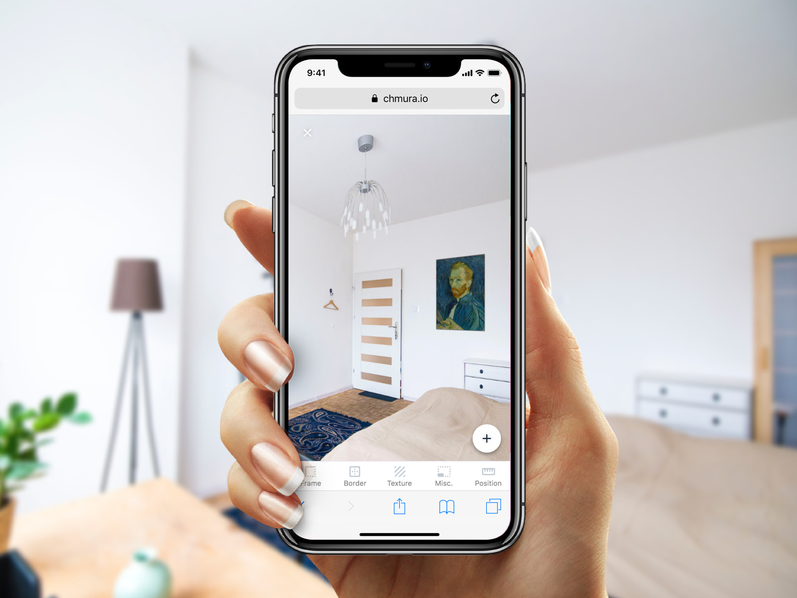
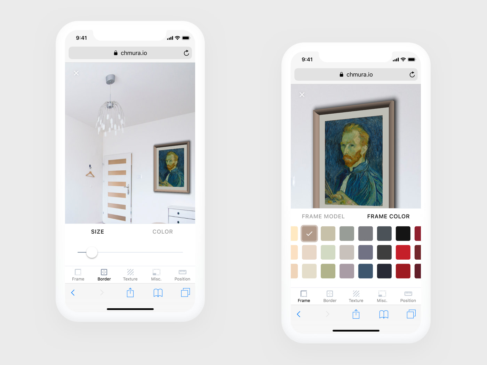
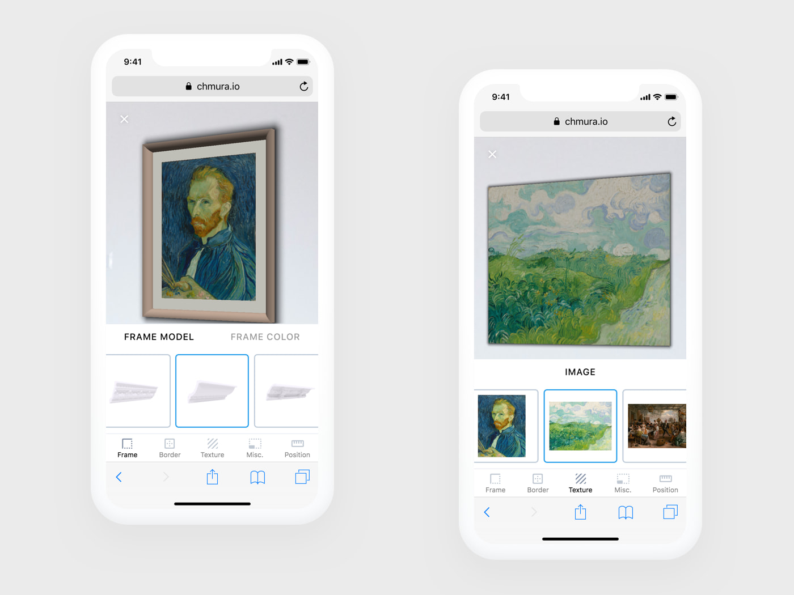

Augmenter lets you style your room with a piece of art before buying it.

By taking the photo of an empty interior space, Augmenter parses the content of that image and builds the matching 3D scene, which is then overlaid back onto the existing image.

As a result, it adds the ability to place, move and modify a piece of art in 3D space. This includes the ability to tweak color and form of an art framing and *passe-partout*, modify it's size and placement on the wall.

By following the plug-in architecture, the app can be easily integrated with existing websites and product ranges available in e-commerce stores.

Augmenter combines the power of client-side machine learning with TensorFlow.js, image processing algorithms and WebGL possibilities to deliver augmented reality experience for the web.

I was involved in every project phase, starting from ideation to deployment. During the lifespan of the project I created multiple application modules and integrated existing libraries.

